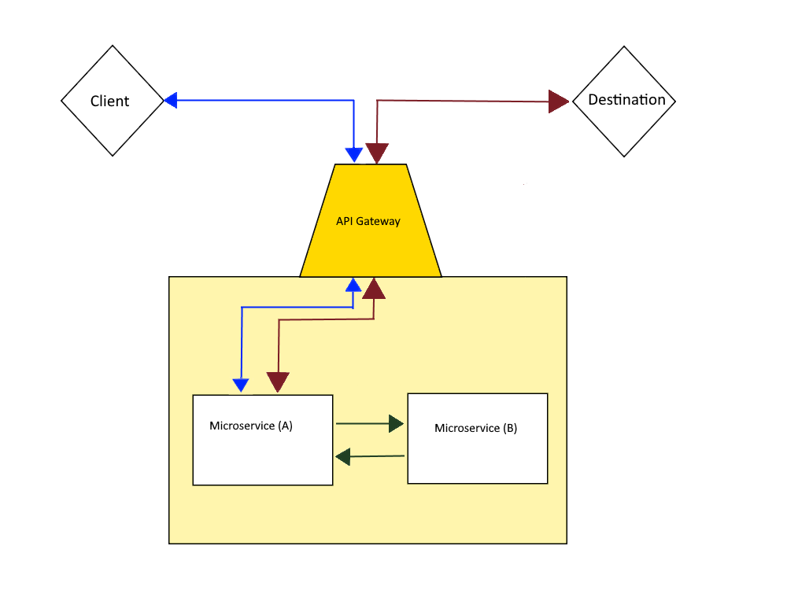

# Picture Publishing Service  
  
An Example of a microservices web application that utilizes websocket as means of communication.

  
  

  
## Overview  
The main idea for this project is to simulate a microservices environment where
 a microservice accepts a websocket request then forwards that request to another microservice.  

## Detailed Requirements  
- An end user client that initiates a websocket request.  
- This request will be mapped by the gateway to a specific microservice. let's say (A).    
- We'll utilize a message broker on this microservice (A). 
- Some logic/ processing will happen per request on microservice (A) then,
 (A) will call for microservice (B) , and finally, the request will be forwarded to its destination
 that also accepts websocket request and responds with a websocket response going all the way back
  to the client. 

## Nonfunctional Requirements  
- the backend database should be an open source standard SQL variety of PostgreSQL  
- must provide scripts for deployment and running unit tests  

## Expected Deliverables  
- the entire project: code and database  
- instructions on how to deploy it  
- REST API documentation (Swagger preferred but anything clear is fine)

## Steps to deploy
- Just load this project on your preferred IDE e.g. Intellij or Netbeans ...etc and Maven will load all dependencies
  and configure directories.  
- This project uses an embedded "h2 database" so there's no need for a dbms e.g. MySQL or Postgres ...etc  

## Authors  
   **Muhammad Ali** - find me on : [LinkedIn](https://www.linkedin.com/in/zatribune).    